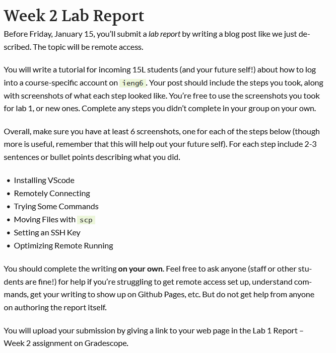

# Week 2 Lab Report - How to remote run stuff

- [Installing VSCode](#installing-vscode)

- [Remotely Connecting](#remotely-connecting)

- [Trying Some Commands](#trying-some-commands)

- [Moving Files with `scp`](#moving-files-with-scp)

- [Setting an SSH Key](#setting-an-ssh-key)

- [Optimizing Remote Running](#optimizing-remote-running)

prompt



## Installing VSCode

Go [here](https://code.visualstudio.com/) and download VSCode


It should look *something* like this:


You can open projects from `File > Open Folder`, and open a new VSCode terminal with `Ctrl` + `Shift` + `` ` ``

---

## Remotely Connecting

Once VSCode is up and working go [here](https://docs.microsoft.com/en-us/windows-server/administration/openssh/openssh_install_firstuse) and follow the directions to download **OpenSSH**. Then come [here](https://sdacs.ucsd.edu/~icc/index.php) to find the `ieng6` account you will be connecting to. Open the terminal and type 
```
ssh cs15lwi22aid@ieng6.ucsd.edu
```
Then if it asks a message to continue connecting, type yes. Then it prompts for your password, which is the either the AD password or course-specific. If everything is done right and connection is successful it should look like this:


---

## Trying Some Commands

Once connected, the terminal will run commands on the remote server. You can try `pwd` which prints the working directory, `ls` which lists files in the working directory, and other terminal commands. Log out of the remote server with `exit` or `Ctrl` + `D`.


---

## Moving Files with `scp`

## Setting an SSH Key

## Optimizing Remote Running