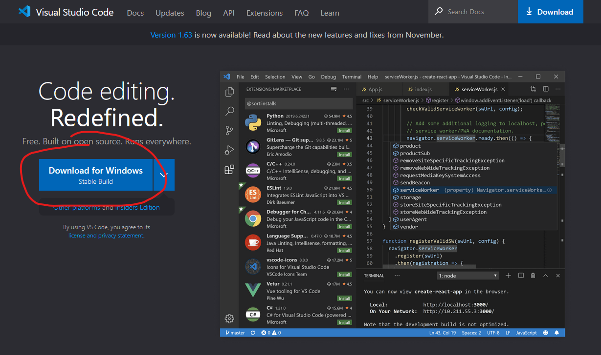
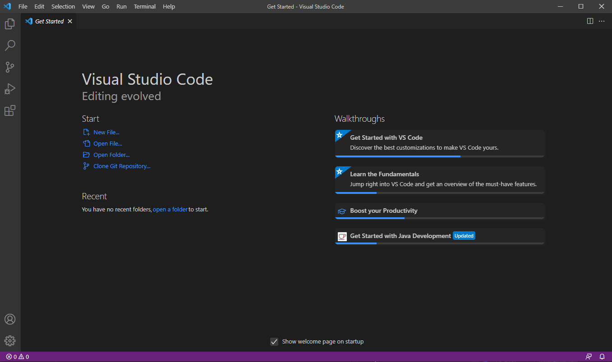
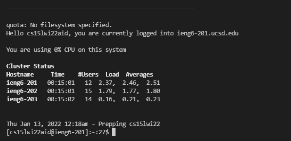
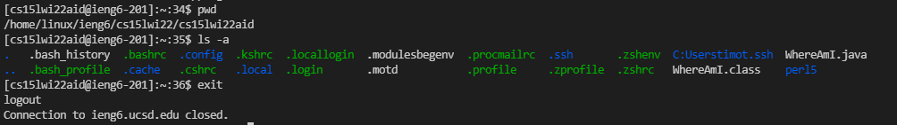
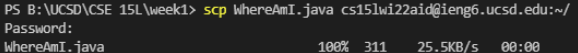
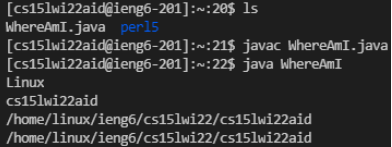
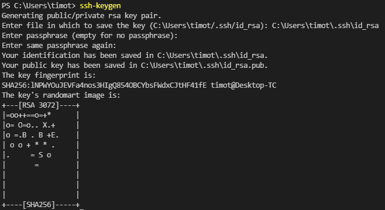
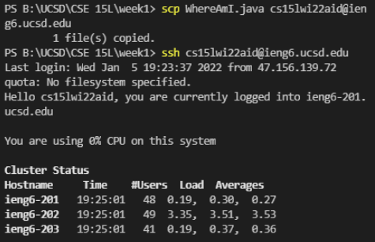
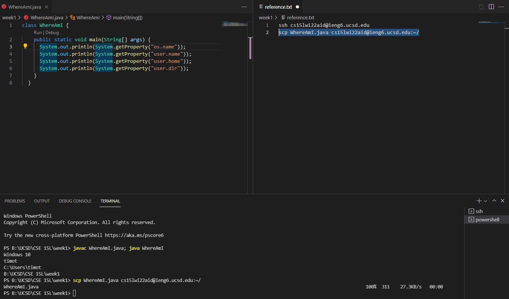

# Week 2 Lab Report - How to remote run stuff

- [Installing VSCode](#installing-vscode)

- [Remotely Connecting](#remotely-connecting)

- [Trying Some Commands](#trying-some-commands)

- [Moving Files with `scp`](#moving-files-with-scp)

- [Setting an SSH Key](#setting-an-ssh-key)

- [Optimizing Remote Running](#optimizing-remote-running)

## Installing VSCode

Go [here](https://code.visualstudio.com/) and download VSCode



It should look *something* like this:



You can open projects from `File > Open Folder`, and open a new VSCode terminal with `Ctrl` + `Shift` + `` ` ``

---

## Remotely Connecting

Once VSCode is up and working go [here](https://docs.microsoft.com/en-us/windows-server/administration/openssh/openssh_install_firstuse) and follow the directions to download **OpenSSH**. Then come [here](https://sdacs.ucsd.edu/~icc/index.php) to find the `ieng6` account you will be connecting to. Open the terminal and type 
```
ssh cs15lwi22aid@ieng6.ucsd.edu
```
Then if it asks a message to continue connecting, type yes. Then it prompts for your password, which is the either the AD password or course-specific. If everything is done right and connection is successful it should look like this:



---

## Trying Some Commands

Once connected, the terminal will run commands on the remote server. You can try `pwd` which prints the working directory, `ls` which lists files in the working directory, and other terminal commands. Log out of the remote server with `exit` or `Ctrl` + `D`.



---

## Moving Files with `scp`

In VSCode, make a file named `WhereAmI.java` with the following code:

```
class WhereAmI {
  public static void main(String[] args) {
    System.out.println(System.getProperty("os.name"));
    System.out.println(System.getProperty("user.name"));
    System.out.println(System.getProperty("user.home"));
    System.out.println(System.getProperty("user.dir"));
  }
}
```

Now in the terminal with current directory being the one with the file type 

```scp WhereAmI.java cs15lwi22aid@ieng6.ucsd.edu:~/```

This will prompt a password, the same one used for `ssh`. Should look like this if successful:



Now log back into the remote server with `ssh` and type `ls` in the console. This should show that there is now `WhereAmI.java` in the folder. Now compile and run the java file on the remote server, it shuold show this:



---

## Setting an SSH Key

Typing passwords = annoying, and `ssh` keys solve this problem.

To up an `ssh` key, use the `ssh-keygen` command like so



If on windows also follow `ssh-add` directions [here](https://docs.microsoft.com/en-us/windows-server/administration/openssh/openssh_keymanagement#user-key-generation)

Now `ssh-keygen` has generated a public and private key pair, and we have to move the public key to the server:

1. While logged into the server, type `mkdir .ssh` and log out.
2. On the client, type `scp \Users\timot\.ssh\id_rsa.pub cs15lwi22aid@ieng6.ucsd.edu:~/.ssh/authorized_keys` and enter password.

Now you can login or copy files without typing the password everytime



---

## Optimizing Remote Running

Commands or tips to quicken the workflow:

 - Use semicolons to run multiple commands in the same line.
 - Open multiple terminals to avoid relogging into `ssh`.
 - Have a list of commonly used commands to copy-paste.
 - Use up arrow in terminal to run recent commands quickly.

