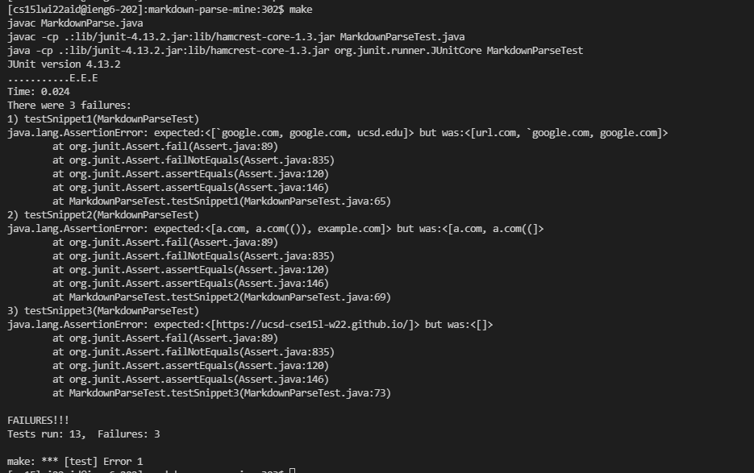

# Lab Report 4

## Debugging

Link to my repo: [here](https://github.com/tea-mochi/markdown-parse)

Link to other group's repo: [here](https://github.com/BasilThaddeus/markdown-parse)

MarkdownParseTest added test cases. The same tests were added in both directories' `MarkdownParseTest.java` :

JUnit output for my implemetation (all of them failed):

JUnit output for other group's implementation (all of them failed):

Snippet 1:

I think this can be fixed by first finding whether inline code exists in the file, i.e. at least two backticks exist, and there is no consecutive newlines between them. Then if it does exist, do not assign `nextOpenBracket`, `nextCloseBracket`, `openParen` to index values within a set of valid backticks(close parentheses prioritizes completing the link). Then hopefully everything within backticks would be ignored and all is good. 

Snippet 2:

I think handling nested links would require a large change, but there would be a relatively simple change to solve cases with nested parentheses, brackets, and escaped brackets. The change would be adding a method to find the close bracket/parenthesses, while counting for any open/close parentheses or open brackets, which is similar to what Joe had in his MarkdownParse. The escaped brackets can also be handled within this method, by checking the index(s) directly before for backslashes.

For nested links I think it would be a more involved change because since the code assumes the first open bracket will be the start of a valid link, we would have to implement some sort of logic to ignore it only if another valid link occurs inside. This would mean that on finding a new open bracket anywhere, even if invalid according to our current code, we have to check if it is the start of a valid link, which seems to be annoying.

Snippet 3:

Our code failed 3 because it checks for spaces between the parentheses and automatically fails if there is a space, the change to fix this would be to ignore spaces between the first parentheses and first non-space character, as well as between the last parentheses and the last non-space character. Our code already checks for newline within the parentheses, we would have to add a check for multiple newlines in a row within the brackets, since single newlines show as a space and are valid.