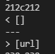
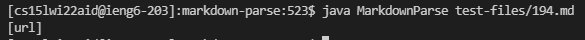
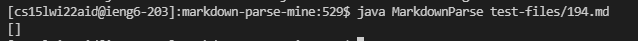
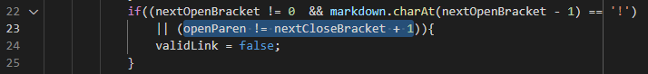
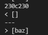
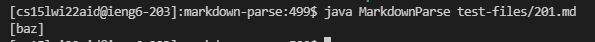
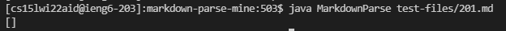
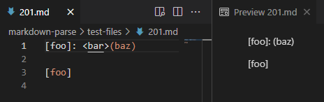
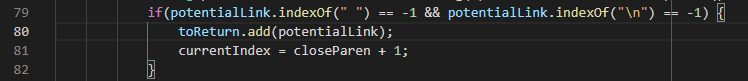

# Lab Report 5

## Code Diff

I found the tests with different results by first running the bash script on the two `MarkdownParse` implementations, and storing each output into a text file. Then I used the `diff` command on the two output files to easily see the differences in output. I go to the line number in the output file to see which corresponding test to look at.

## Test 1

One difference is on test file `194.md`.

Bash script output diff:
`<` is my implementation, `>` is the lab 9 implementation.

Line 212 corresponds to `194.md`.

Neither of the implementations are correct: the expected output is `[title (with parens)]`

For our implementation of `MarkdownParse`, the bug is that we explicitly check that the close bracket is immediately followed by the open parentheses, and didn't account for this alternate way to insert a link, so this case fails.

## Test 2

Line 230 corresponds to `201.md`.

Our implementation had the correct output(not for the right reasons though), but the provided implementation incorrectly output `[baz]` instead of `[]`.

For lab 9's version of `MarkdownParse`, the bug is that the implementation doesn't check for html tags between the brackets and parentheses before returning the link text.

